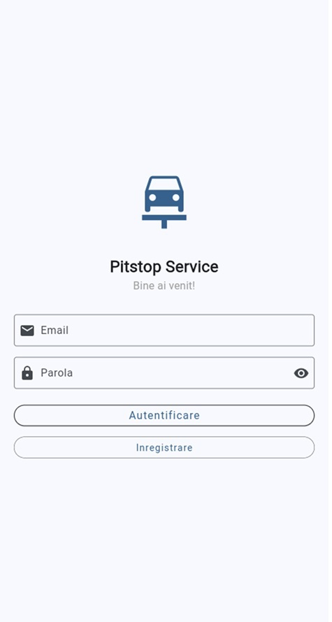
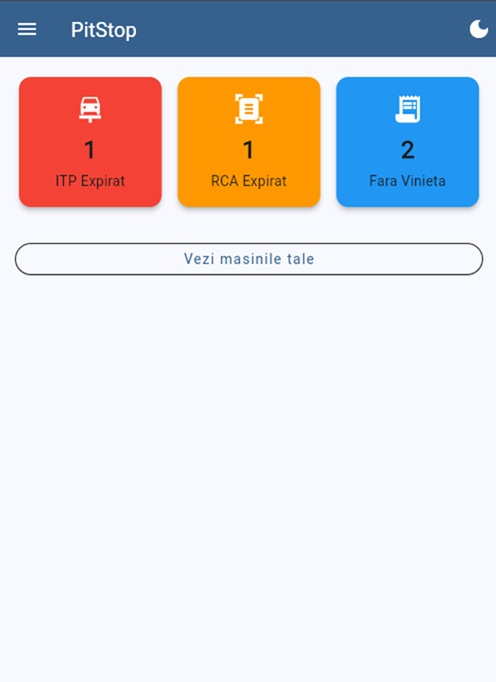
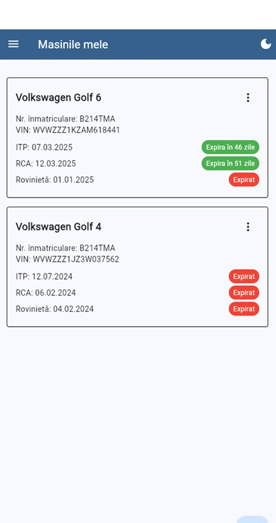

# Pitstop 🚗

## Descriere
Pitstop este o aplicație mobilă dezvoltată în Flutter care ajută șoferii să își gestioneze documentele auto (ITP, RCA, Rovinieta) într-un mod simplu și eficient.

## Funcționalități Principale
- 👤 Autentificare și înregistrare utilizatori
- 🚙 Gestionare multiplă vehicule
- 📄 Urmărire documente auto (ITP, RCA, Rovinieta)
- 📊 Dashboard cu statistici despre starea documentelor
- 📱 Interfață intuitivă și prietenoasă

## Tehnologii Utilizate
- Flutter pentru dezvoltare cross-platform
- Firebase pentru backend și autentificare
- Cloud Firestore pentru baza de date

## Cerințe Sistem
- Flutter SDK: ultima versiune stabilă
- Dart SDK: ultima versiune stabilă
- Android Studio / VS Code cu plugin-uri Flutter
- Firebase CLI pentru configurare

## Instalare
1. Clonează repository-ul:
```bash
git clone https://github.com/iSkyleOne/pitstop
```

2. Navighează în directorul proiectului:
```bash
cd pitstop
```

3. Instalează dependențele:
```bash
flutter pub get
```

4. Configurează Firebase:
   - Creează un proiect nou în Firebase Console
   - Descarcă și adaugă fișierul google-services.json pentru Android
   - Descarcă și adaugă fișierul GoogleService-Info.plist pentru iOS
   - Activează serviciile necesare în Firebase Console (Authentication, Firestore, Cloud Messaging)

5. Rulează aplicația:
```bash
flutter run
```

## Structura Proiectului
```
lib/
  ├── models/        # Modele de date
  ├── screens/       # Ecrane aplicație
  ├── services/      # Servicii (Firebase, etc.)
  ├── widgets/       # Widget-uri reutilizabile
  ├── utils/         # Utilități și helper-e
  └── main.dart      # Punct de intrare aplicație
```

## Configurare Firebase
1. Activează următoarele servicii în Firebase Console:
   - Authentication
   - Cloud Firestore
   - Cloud Messaging
   - Cloud Functions (opțional)

2. Adaugă regulile de securitate necesare în Firestore:
```javascript
rules_version = '2';
service cloud.firestore {
  match /databases/{database}/documents {
    match /users/{userId} {
      allow read, write: if request.auth != null && request.auth.uid == userId;
    }
    match /vehicles/{vehicleId} {
      allow read, write: if request.auth != null && resource.data.userId == request.auth.uid;
    }
  }
}
```

## Contribuții
Contribuțiile sunt binevenite!

## Licență
[MIT](LICENSE)

## Contact
Pentru întrebări și suport, vă rugăm să deschideți o issue în repository.

## Screenshots




## Dezvoltare Viitoare
- [ ] Scanare documente cu OCR
- [ ] Integrare service-uri auto
- [ ] Istoric reparații și mentenanță
- [ ] Sistem de reminder-uri personalizabile
- [ ] Secțiune comunitate și sfaturi

## Mulțumiri
Mulțumim tuturor contributorilor și utilizatorilor care au ajutat la îmbunătățirea aplicației Pitstop.